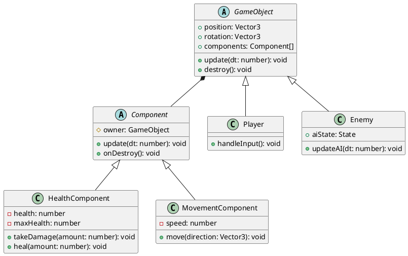

# Plantillas para Diagramas UML

Este archivo contiene instrucciones para crear los diagramas UML requeridos en el proyecto.

## Herramientas Recomendadas

### Online (Gratis)
- **Draw.io / diagrams.net** - https://app.diagrams.net/
- **PlantUML Online** - http://www.plantuml.com/plantuml/uml/
- **Lucidchart** (versión gratuita limitada)

### Desktop
- **Visual Paradigm Community Edition** (Gratis)
- **StarUML** (Versión gratuita)
- **PlantUML** con VSCode extension

## Diagramas Requeridos

### 1. Diagrama de Clases
**Archivo:** `clases/diagrama_clases_principal.png`

**Debe incluir:**
- Clase GameObject base
- Clases hijas (Player, Enemy, Item)
- Componentes principales (HealthComponent, MovementComponent, etc.)
- Relaciones (herencia, composición, asociación)
- Atributos y métodos principales

### 2. Diagrama de Casos de Uso
**Archivo:** `casos_uso/casos_uso_sistema.png`

**Debe incluir:**
- Actor: Jugador
- Casos de uso principales (Mover, Atacar, Usar Item, Guardar, etc.)
- Relaciones include/extend si aplican

### 3. Diagrama de Estados (FSM)
**Archivo:** `estados/player_fsm.png` y `estados/enemy_ai_fsm.png`

**Debe incluir:**
- Estados del jugador o IA
- Transiciones entre estados
- Condiciones de transición

### 4. Diagrama de Secuencia
**Archivo:** `secuencia/game_loop.png`

**Debe incluir:**
- Flujo del game loop
- Interacción entre objetos principales
- Orden temporal de llamadas

### 5. Diagrama de Componentes/Arquitectura
**Archivo:** `arquitectura_general.png`

**Debe incluir:**
- Capas de la aplicación
- Módulos principales
- Dependencias entre componentes

## Ejemplo de PlantUML para Diagrama de Clases

## Instrucciones

1. Crea los diagramas usando las herramientas mencionadas
2. Exporta en formato PNG (resolución mínima 1920x1080)
3. Guarda en la carpeta correspondiente dentro de `/diagramas/`
4. Referencia los diagramas desde ARQUITECTURA.md y GDD.md

## Convenciones

- Usa colores consistentes (ej: clases base en azul, componentes en verde)
- Incluye leyenda si usas símbolos no estándar
- Asegúrate de que el texto sea legible (fuente mínima 12pt)
